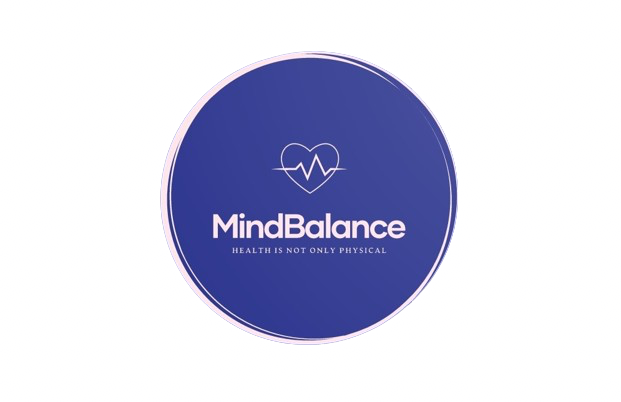

# Bootcamp Desarrollo de Apps Móviles - Proyecto final

  

---

  <strong>Backend</strong>

---

## Índice
 
* [💧 Servidor en Vapor](#server)
* [✍🏼 Autores/as](#autorxs)
* [©️ Licencia](#licencia)

## 💧 Servidor en Vapor

## ✍🏼 Autores/as

<table>
  <tbody>
    <tr>
      <td align="center" width="14.28%"><a href="https://github.com/manuelCAZALLA"> <b>Manuel Cazalla</b></a></td>
      <td align="center" width="14.28%"><a href="https://github.com/nataliacamero"> <b>Natalia Camero</b></a></td>
      <td align="center" width="14.28%"><a href="https://github.com/NatCam22"> <b>Natalia Hernández</b></a></td>
      <td align="center" width="14.28%"><a href="https://github.com/Castellano46"> <b>Pedro Liébana</b></a></td>
      <td align="center" width="14.28%"><a href="https://github.com/salvaMsanchez"> <b>Salva Moreno</b></a></td>
    </tr>
  </tbody>
</table>

## ©️ Licencia

Este proyecto está bajo la Licencia MIT - ver el archivo [LICENSE.md]() para más detalles.